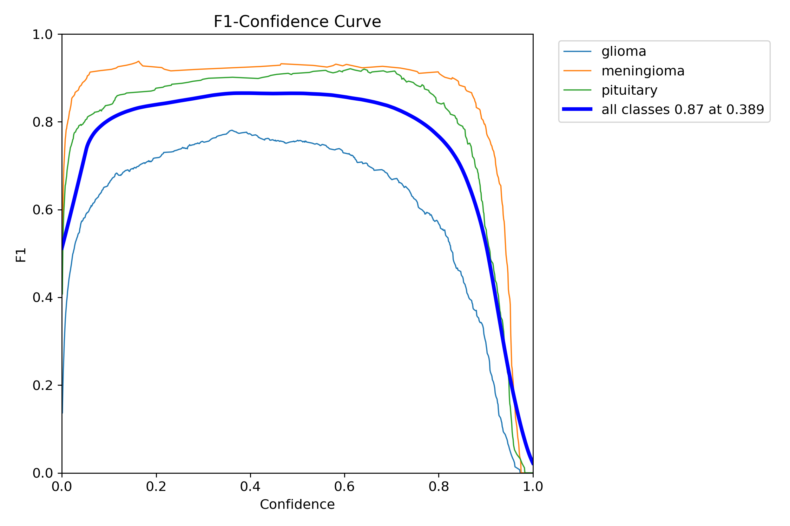
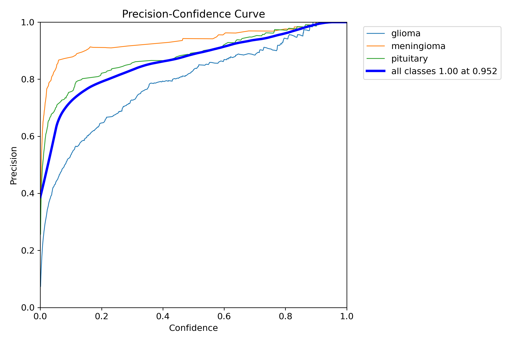
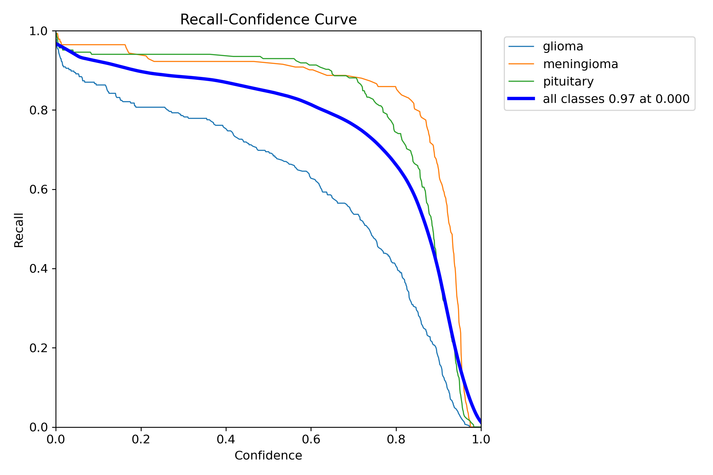
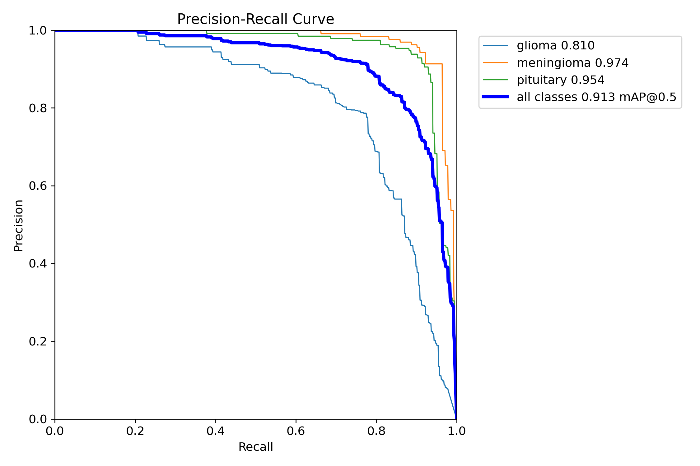
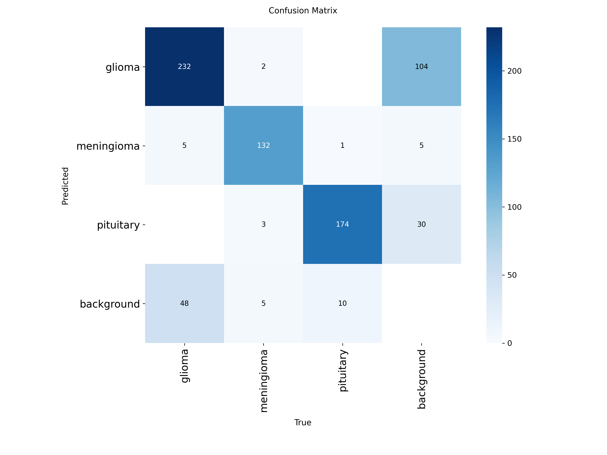
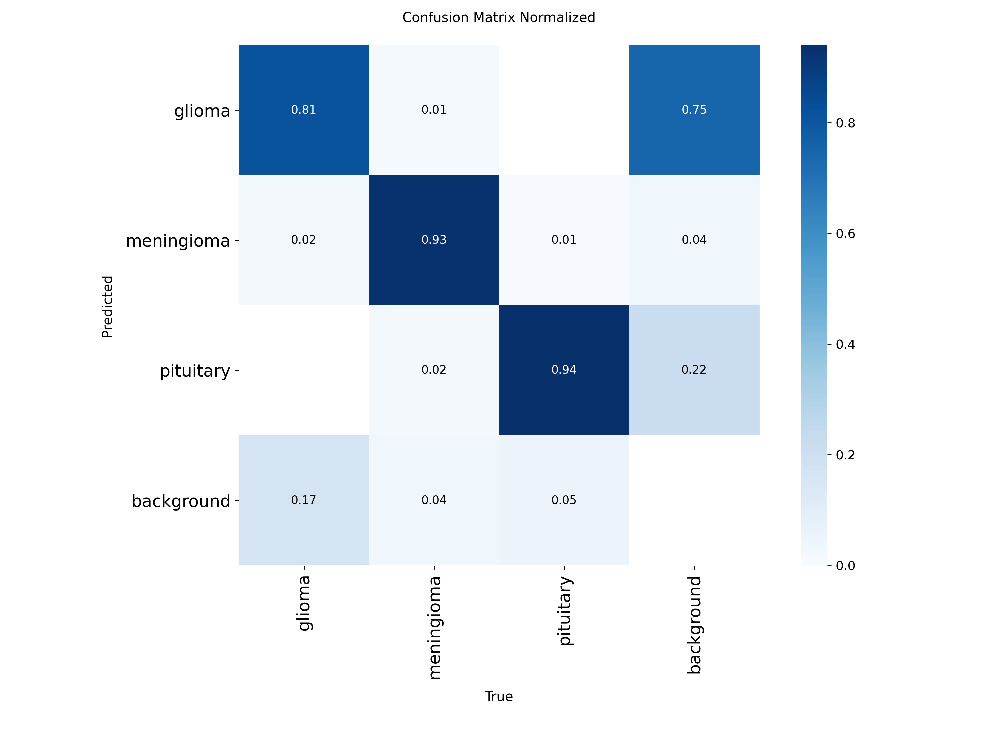
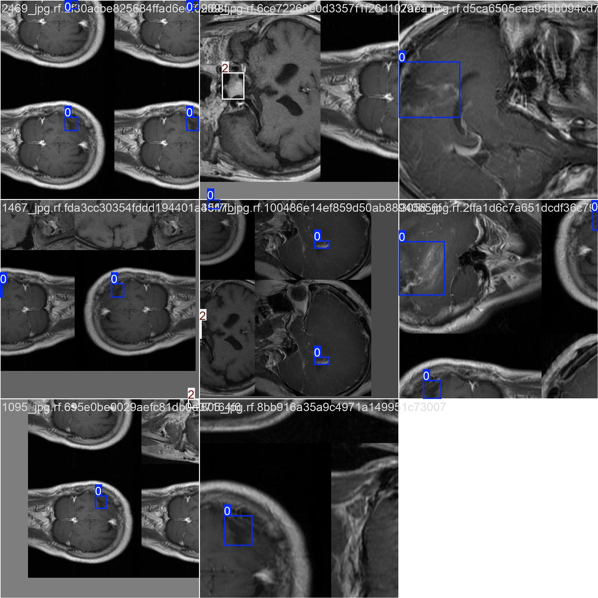
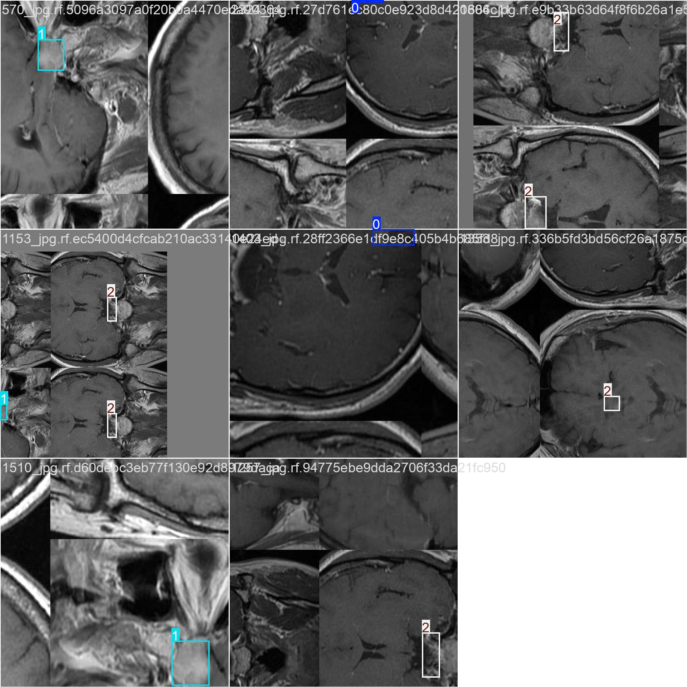
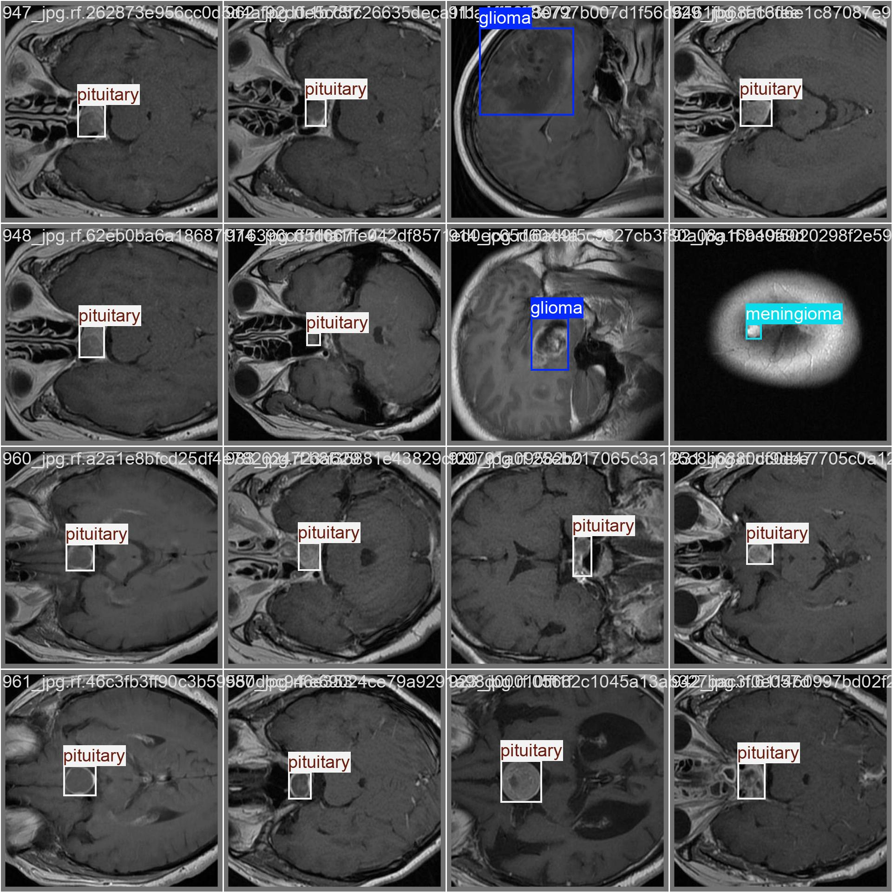
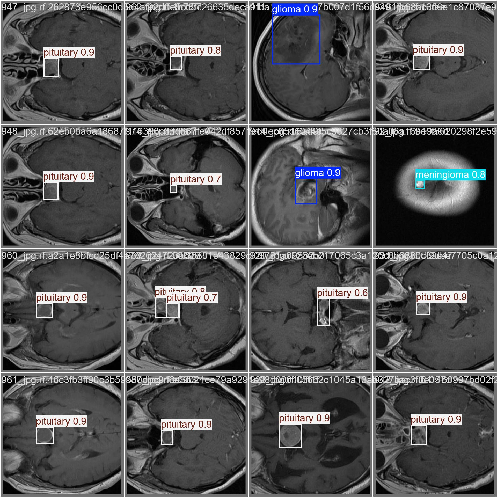

# Brain Tumor Detection with YOLOv9

## Project Overview
This project leverages the YOLOv9 object detection model to accurately detect and localize brain tumors in medical images. The workflow covers dataset preparation, model training, evaluation, and inference. All code and results are available in the Jupyter notebook `YOLOv9_BrainTumor_Detection.ipynb`.

## Directory Structure
```
├── YOLOv9_BrainTumor_Detection.ipynb   # Main notebook for data prep, training, and inference
├── brain-tumor-sample.jpg              # Example image for inference
├── GlioblastomaBranScans-700x467.jpg   # Example image for inference
├── ijms-23-01187-g001.png              # Example image for inference
├── Screenshot 2025-09-13 234516.png    # Example image for inference
├── models/
│   └── yolov9_brain_tumor.pt           # Trained YOLOv9 model weights
├── runs/
│   ├── cancer_detection/               # Inference results
│   └── cancer_detection2/              # Inference results
└── yolov9_brain_tumor/
   └── exp1/
      ├── weights/
      │   ├── best.pt                 # Best model checkpoint
      │   └── last.pt                 # Last model checkpoint
      ├── args.yaml                   # Training arguments
      ├── BoxF1_curve.png             # F1 score curve
      ├── BoxP_curve.png              # Precision curve
      ├── BoxPR_curve.png             # Precision-Recall curve
      ├── BoxR_curve.png              # Recall curve
      ├── confusion_matrix.png        # Confusion matrix
      ├── confusion_matrix_normalized.png # Normalized confusion matrix
      ├── labels.jpg                  # Label visualization
      ├── results.csv                 # Training results
      ├── results.png                 # Training summary
      ├── train_batch*.jpg            # Training batch samples
      ├── val_batch*_labels.jpg       # Validation labels
      ├── val_batch*_pred.jpg         # Validation predictions
      └── ...
```

## Model Features & Performance

### Custom Trained YOLOv9 Model
The YOLOv9 model was custom trained for brain tumor detection. Key performance metrics and visualizations from the best training run (exp1) are provided below:

#### Final Validation Metrics (Epoch 50)

| Metric                | Value   |
|-----------------------|---------|
| Precision             | 0.8878  |
| Recall                | 0.8597  |
| mAP@0.5               | 0.9127  |
| mAP@0.5:0.95          | 0.6924  |
| Box Loss              | 0.9912  |
| Class Loss            | 0.7001  |
| DFL Loss              | 1.4412  |

These results indicate high accuracy and robust detection capability for brain tumors in medical images.

#### Training Results & Visualizations

**F1 Score Curve:**


**Precision Curve:**


**Recall Curve:**


**Precision-Recall Curve:**


**Confusion Matrix:**


**Normalized Confusion Matrix:**


**Sample Training Batch:**



**Sample Validation Predictions:**



These results demonstrate the model's strong performance in detecting and localizing brain tumors. For detailed metrics, refer to `results.csv` and `results.png` in the exp1 folder.

---

## How to Use

1. **Dataset Preparation:**
   - Prepare your dataset in YOLO format. (Images and corresponding label files.)
   - Update your config files as needed (e.g., `args.yaml`).

2. **Model Training:**
   - Open and run `YOLOv9_BrainTumor_Detection.ipynb` to train the YOLOv9 model.
   - Training outputs (weights, logs, plots) are saved in `yolov9_brain_tumor/exp1/`.
   - The best model is saved as `models/yolov9_brain_tumor.pt`.

3. **Inference:**
   - Use the notebook to run predictions on new images.
   - Results are saved in the `runs/cancer_detection*` folders.

4. **Visualization:**
   - Training and validation results, confusion matrices, and sample predictions are available as images in `yolov9_brain_tumor/exp1/`.

## Requirements
- Python 3.8+
- ultralytics
- opencv-python
- matplotlib

## License & Copyright

Copyright © Jaikishan Nishad, 2025.

This project and its contents were created by Jaikishan Nishad. All rights reserved.

You may use, share, or modify this project for educational and research purposes, provided proper attribution is given. For commercial use or other inquiries, please contact the author directly.

**Author:** Jaikishan Nishad  
**GitHub:** [JaikishanNishad](https://github.com/Jaikishan1228)  
**Contact:** jaikishannishad33@gmail.com  
**Date:** 16th September 2025
